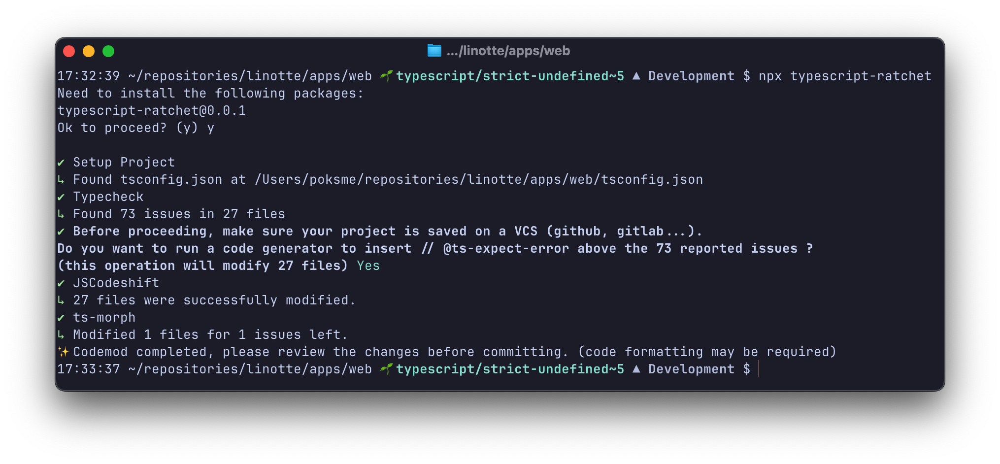
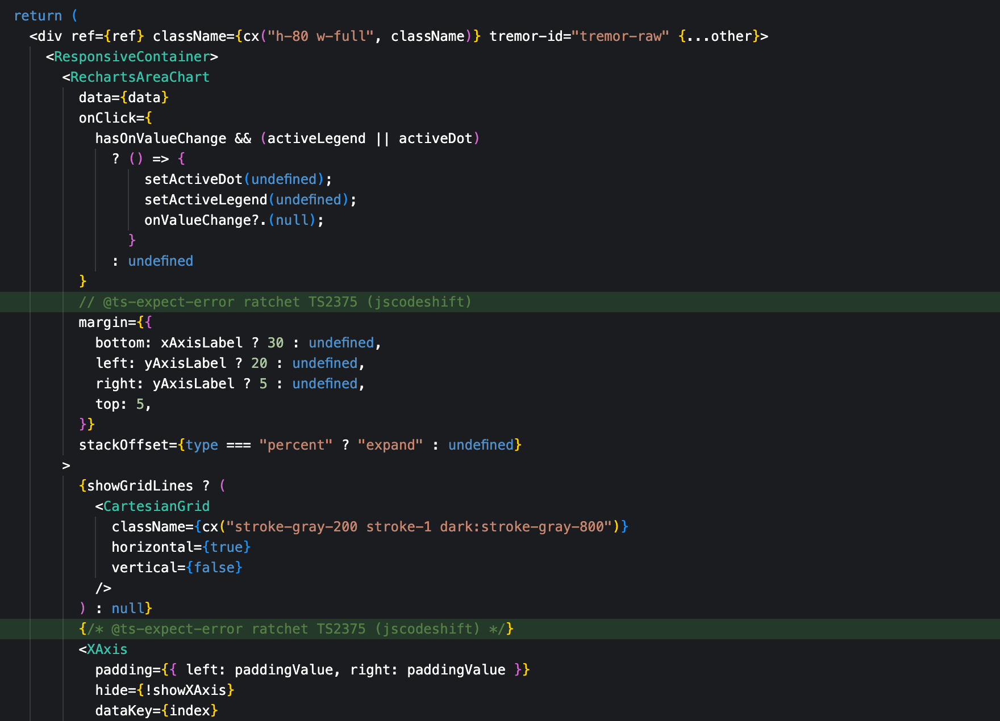

# Typescript Ratchet (beta)

> CLI tool to "ratchet" your typescript codebase.

To _ratchet_ is the act of tightening or adjusting something incrementally. In the context of static analysis, it is the process of adding new configurations or rules to your codebase to make it more strict while allowing newly reported issues on existing code and disallowing them on new code.

## Usage
```bash
npx typescript-ratchet
```



## Features
- Runs _Typescript_ to find all problems in your codebase.
- Uses _JSCodeshift_ first to transform your ts/tsx codebase. Adds `@ts-expect-error` comments to AST nodes in error.
- Uses _ts-morph_ as a fallback for unsupported Typescript keywords (e.g. `satisfies`) with a simple insert comment line strategy.

## Warnings
- Make sure to backup your code to your VCS of choice before running this tool.
- This tool is in beta and may not work as expected, in that case, feel free to open an issue with steps to reproduce.
- Formatting may be necessary after running these codemods (`prettier`, `eslint --fix`).

## License

MIT
